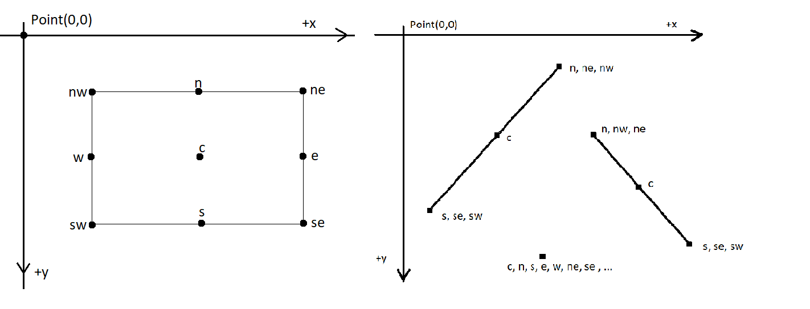

# graphics-system-with-stars-in-cpp-
## Functions:
- **DispWindow w(n,m) -->** dynamically creates an area of size n by m on the screen.  
**w.current()** has a current position. Initially, current is Point(0,0)  
The current position can be set by w.current(Point(x,y))  
                      
- **Point P(x,y) -->** point is created at specified coordinate pair. A cartesian coordinate, Point(x,y) can be modified by an amount n using: right(n), left(n), up(n),
down(n).

- **Dot d(x,y) or Dot d(Point(x,y)) --->** dot is created at specified coordinate pair

- **Line L(Point(x1,y2),Point(x2,y2)) -->** line is created that passes through the specified coordinate pair.

- **Rectangle r(Point(x1,y2),Point(x2,y2)) -->** A rectangle is created whose bottom left and top right corners pass through the specified points.

- **class Shape -->**  is the common interface to Dots, Lines and Rectangles.A Shape is invisible unless it is **draw()**.
very Shape has 9 contact points: **e(east), w(west), n(north), s(south), ne, nw, se, sw and c (center)**.After draw() ing a Shape, the current position is the Shape’s se().

- After drawing is complete, you can **show()** the content of your DisplayWindow w using w.show();

 
